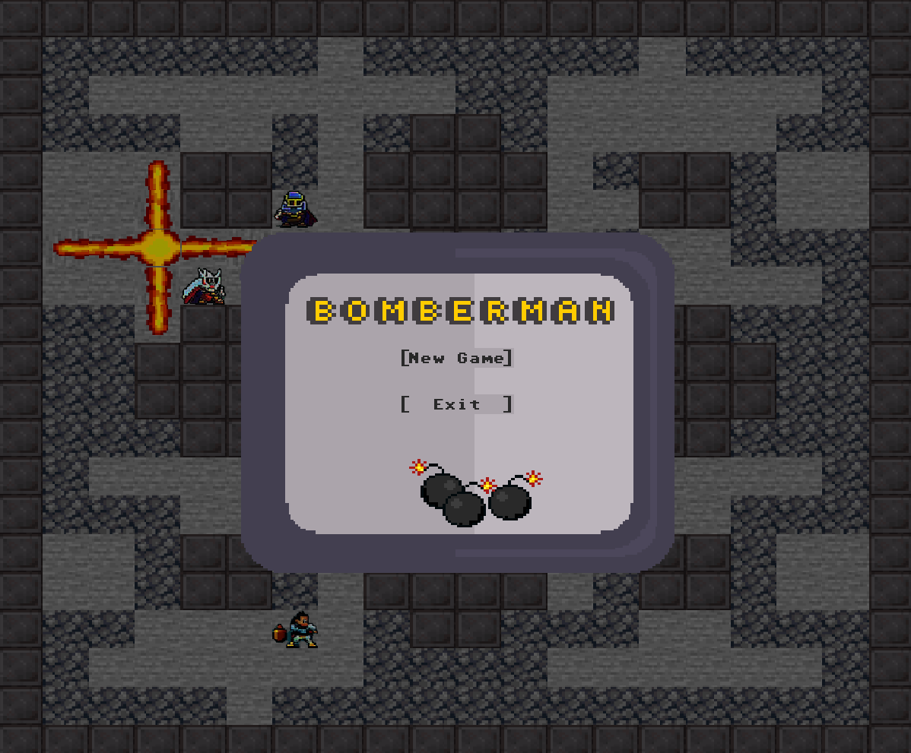
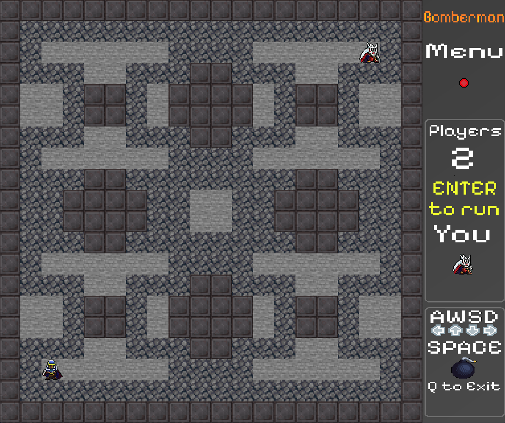

## Bomberm4n

 

A classic arcade network game that involves getting rid of enemies with bombs.

## Previews






## Technologies
- LibGDX 1.11.0

## Requirements

- JDK 9.0
- Gradle 8.0.2

## Application execution

1. Make sure your JAVA_HOME paths to jdk directory.
2. Clone repository:
```
git clone https://github.com/Mishu5/Bomberman-multiplayer.git
```
3. Open application root directory and run server:
```
gradle :server:run
```
4. Run client:
```
gradle :desktop:run
```

## Configuration and rules

1. Select target IP address in `config.txt` file placed in assets directory.
2. Make your own 20x20 map by using special characters (map's name has to start with `map`)
```
x   free space
-   wall
+   destructible wall
R   spawn
```
3. Control server using commands:
```
start       -   start game
quit        -   shut down server
time        -   check game time
cords       -   check players position
rate 100    -   change communication delay to 100ms
```
4. Control your character in game:
```
W       -   move up
S       -   move down
A       -   move left
D       -   move right
SPACE   -   place bomb
Q       -   disconnect
ENTER   -   start game (only for host)
```

